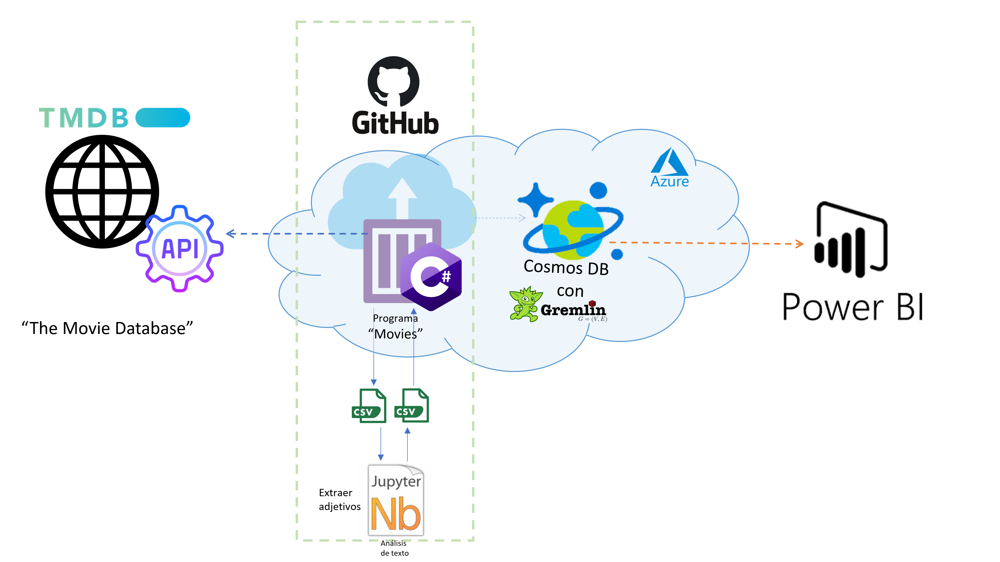
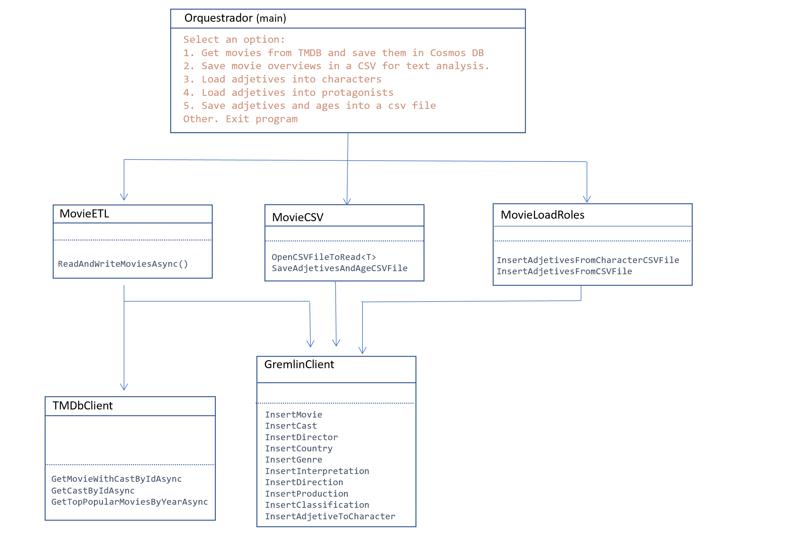

# TFM

Data Science Master Final Project

## Graphs
https://isabelcabezasm.github.io/genderinequalityfilmindustry/

## Repository description

This repository is part of the final thesis for my Data Science Master.
See the complete architecture of the project:



In this repo the program "Movies", the jupyter notebooks for text analysis and the CSV files can be found.

`/GetMovies` folder:

"GetMovies" is the ETL program. It extracts movies from the TMDB web page (through the API), applies some transformation to the movie information and save it into the graph-based NoSQL database in CosmosDB.

Here is the class schema for the pgrogram `GetMovies`:



Where `TMDBClient` and `GremlinClient` are the client to the TMDB API and the DB.

We have four main functionalities:

- Extract, transform and Load from TMDB Web to DB (ETL)

- Save movie information into a CSV file for the Jupyter text analysis.

- Load CSV file created by the Jupyter Notebooks into the DB.

`/notebooks` folder:

Jupyter Notebooks are used for extract nouns and adjectives that describe character roles of the movie (with NPL we extract the key words that can help us to understand how are the characters)

`/CSV` folder:

The interface between “Movies” and the Notebooks are CSV files.
The ETL program saves information about movies in one CSV file that can be use for the two Notebooks for the overview text analysis.


## Configuration

You can set the environment variables needed for running the application:

With the command "export" if you are in Linux:

```cmd
export Host="<server name>.gremlin.cosmos.azure.com:443/"
```

or adding the section "env" in the launch.json file: 

```json
"env": {
    "Host": "<server name>.gremlin.cosmos.azure.com:443/",
    "PrimaryKey": "<primary key - cosmos db>",
    "DatabaseName":"<db name of cosmos db>",
    "ContainerName":"<container name of cosmos db>",
    "TMDBtoken":"<token>"
}
```

